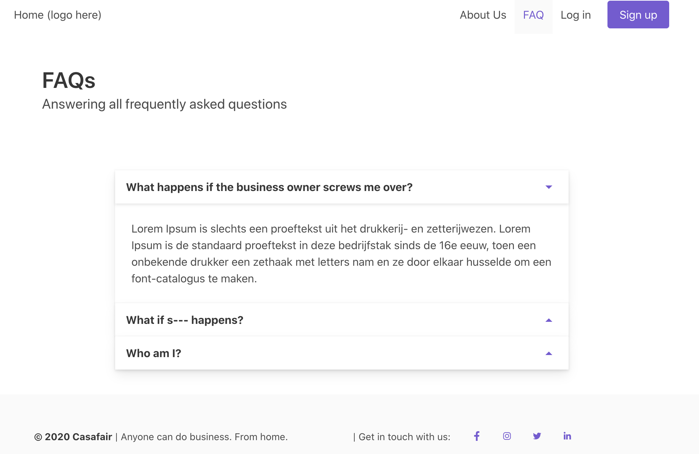

# How to include components

This is where components are stored. There are three folders:

- **items**: This is used for modular items, such as cards, that you can reuse at every page
- **layouts**: This is where you store modularised layouts, such as a Carousel of images, that you can reuse at every page
- **templates**: Here, you can find sample templates for each page that you can copy paste to reuse in other pages. **Do not import them into your pages.**

## Importing and using

Consider the following file `HeroGallery.vue` where I want to use it in the home page:

```html
    <section class="">
        <div class="hero">
            <div class="hero-body">
                <HeroGallery/>          // just call the file this way
            </div>
        </div>
    </section>
```

## Parameters for components

Sometimes, you want to include parameters in the file, like for example, the `StaticPageHeader`. `StaticPageHeader`is where we use to display the page header. For example, a header like below, where you can display a hero image and the page title:


For this, we'll use `StaticPageHeader.vue`. Consider the following page template in `FAQ/index.vue`:

```html
<section>
    <!-- import StaticPageHeader.vue -->
    <StaticPageHeader :title="pageName" :description="pageDescription"/>
    ...
</section>
```

and in the script tags of the same file:

```js
    // ...
    data() {
        return {
            pageName: "FAQs",
            pageDescription: "Answering all frequently asked questions",

            // ...
        }
    }
    // ...
```

Here, I included the `title` and `description` to describe what this current page is. The rendered page will call the `StaticPageHeader.vue` from the **components/layouts** folder and display that component at the top of the page. So it will display something like below:

