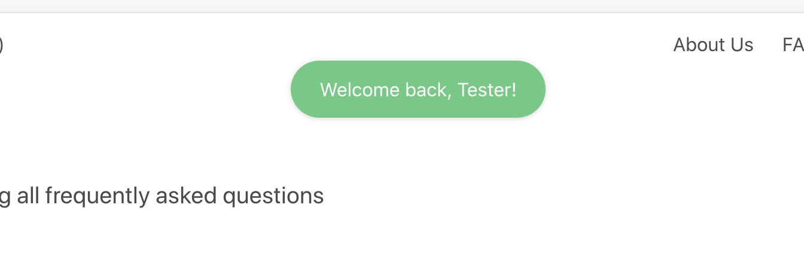

# Working with global variables and functions

We might have functions and/or variables that are used throughout our web app. For example, if we have a function for creating an alert banner, rather than coding on every page, we include it in the `plugins/helpers.js` file. This is a mixin that is automatically included on every page with the same Vue syntax. For example:

```js
    methods: {
        // message = msg u want to display
        // type = bulma css class for colour (ie. is-danger for red alerts)
        // duration = time in seconds
        snackbarAlert(message, type, duration) {
            this.$buefy.snackbar.open({
                duration: duration,
                message: message,
                type: type,
                position: 'is-bottom-left',
                actionText: 'x',
                queue: false,
            })
        },
    }
```

Rather than coding this on every page, we can just call this function on every page as follows:

```js
    // ...
    this.snackbarAlert("Welcome back, " + this.firstName, "is-success", 5000)
```

and it will display below:



## API variables

To change API variables, like URL, change the `api.js` folder. This folder will be imported in `helpers.js`. For example:

```js
//  api.js
export const devBASE = "http://localhost";
export const prodBASE = "";

export const BASE = devBASE;

export const USER = BASE + ":7001/user";

export default {
    USERAPI: USER,
}
```

```js
// helpers.js
    data() {
        return {
            // Put all global variables here
            appName: "Casafair",
            appSlogan: "Anyone can do business. From home.",
            appDescription: "Casafair is the first platform to connect home businesses with Singaporeans. It makes transactions easy, frictionless and fast.",


            // API Setup

            USERAPI: api.USERAPI
        }
    }
```

Notice that you can also change the `appName` and `appSlogan` and it will be reflected on every page. You don't even have to change it on every page. Plus side is that you can also just call `this.appName` to retrieve the app name in the moustache syntax `\{\{appName\}}`.